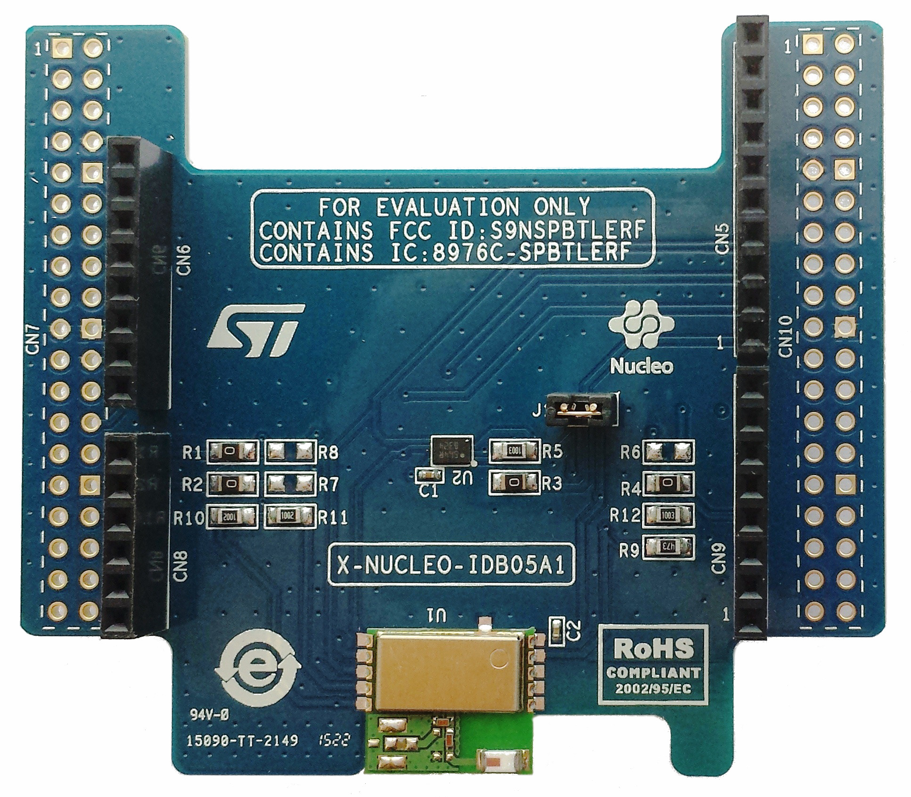

**Priyatoonz-Sportz**

  

Priyatoonz-Sportz is AI based GPL licensed (except AI Deployment IPCores
and AI Deployment Software Libraries and relevant device drivers) Sports
Data Capture platform built around following set of hardware:

  

  

**1. Xilinx Zynq-7000 FPGA based Digilent Zybo Board**

  

  

For more details, please
visit:

<https://www.xilinx.com/products/boards-and-kits/1-4azfte.html>

<https://www.xilinx.com/support/university/boards-portfolio/xup-boards/DigilentZYBO.html>

  

  

  

**2. ST Microelectronics I-NUCLEO-LRWAN1**
**USI®
STM32™ Nucleo expansion board for LoRa™** ****

  

  

  

  

  

  

  

  

  

  

  

  

  

  

  

  

  

  

  

For more details, please
visit:

  

<https://www.st.com/en/evaluation-tools/i-nucleo-lrwan1.html>

  

  

**3. ST Microelectronics**
**X-NUCLEO-IDB05A1
Bluetooth Low Energy expansion board based on SPBTLE-RF module for STM32
Nucleo**

  

  

For more details, please
visit:

<https://www.st.com/en/ecosystems/x-nucleo-idb05a1.html>

  

  

**4.**
**STM32
Nucleo-64 development board with STM32L053R8 MCU**
****

  

  

  

  

  

  

  

  

  

For more details, please
visit:

<https://www.st.com/en/evaluation-tools/nucleo-l053r8.html>

  

  

  

**5. ublox NEO Series GPS Module (for outdoor MoCap):**

  

  

  

  

  

  

  

  

  

  

  

  

  

  

  

For more details, please
visit:

<https://www.u-blox.com/en/product/neo-6-series>

  

  

  

  

  

  

  

  

6. Sports RADARS and other
biomedical sensors

  

For more
details:

http://www.sportssensors.com/

  

  

NEO 6 Series and onwards can be uses. Other compatible hardware can also
be used for any of above hardware, IoT hardware other than LoRa/BLE
compatible can also be used, but source code compatibility and testing
in not 100% guaranteed.

  

The Priyatoonz-Sportz repository and its derived projects are intended
for Poof-of-Concept (PoC) only-where user can test her program codes,
however new design of customized hardware may be required for most of
commercial
applications.

  

**We provide time-limited non-commercial license for use of our Anasim
Processor AI IPCores (With runtime limited to 1 hour from device
power-on) free of cost for academic or non-commercial users who work on
our Priyatoonz repositories based open source projects. Please visit our
github account
(****[https://github.com/DSP-Channe](https://github.com/DSP-Channel)[l](https://github.com/DSP-Channel)****)
for more details on Priyatoonz Open Source Projects. Contact at**
[**charu@priyatooz.com**](mailto:charu@priyatooz.com)
**for commercial and the non-commercial licenses and AI IPCores
downloads and visit**
[**www.priyatoonz.com**](http://www.priyatoonz.com/)
**for more details. You may contact at**
[**cto@anasim.in**](mailto:cto@anasim.in)
**for new Anasim Processor AI IPCores and Software Library related
development work.**

The device drivers for our AI IPCores, source codes will be made
available for petalinux alongwith relevant instructions to install and
to run.

  

Besides applications in Sports, our AI IPCores and AI Software Libraries
have applications in bio-medical, robotics, sports and military training
etc. Our AI platform is tightly integrated with ARKit and ARCore,
**visit**
[**www.priyatoonz.com**](http://www.priyatoonz.com/)
**for more details.**
