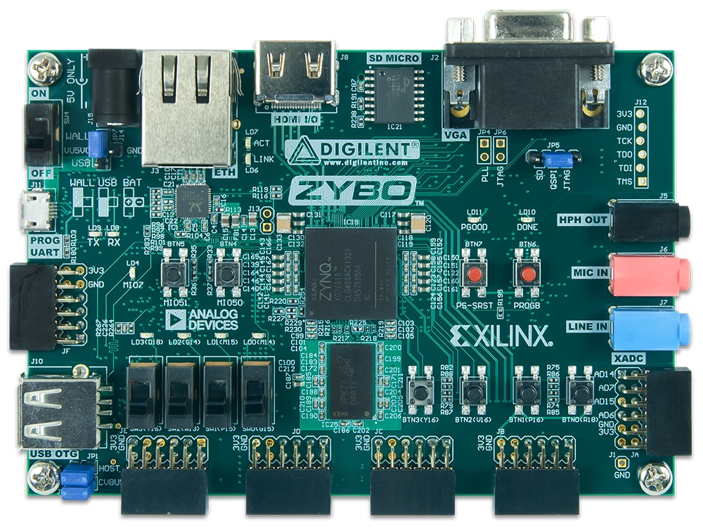
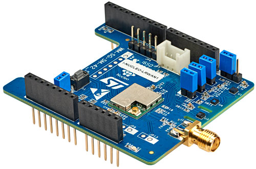
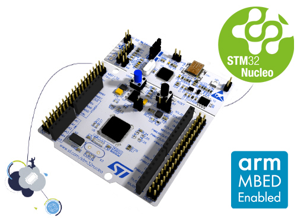
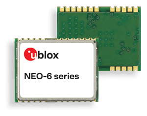

**Priyatoonz-Sportz**

Priyatoonz-Sportz is AI based GPL licensed (except AI Deployment IPCores
and AI Deployment Software Libraries and relevant device drivers) Sports
Data Capture platform built around following set of hardware:

**1. Xilinx Zynq-7000 FPGA based Digilent Zybo Board**

{width="643"
height="485"}\

For more details, please visit:

[[<https://www.xilinx.com/products/boards-and-kits/1-4azfte.html>]{.underline}]{lang="zxx"}

[[<https://www.xilinx.com/support/university/boards-portfolio/xup-boards/DigilentZYBO.html>]{.underline}]{lang="zxx"}

**2. ST Microelectronics I-NUCLEO-LRWAN1** [[[**USI® STM32™ Nucleo
expansion board for
LoRa™**]{style="font-style: normal"}]{style="letter-spacing: normal"}]{style="font-variant: normal"}

{width="500"
height="331"}\

For more details, please visit:

[[<https://www.st.com/en/evaluation-tools/i-nucleo-lrwan1.html>]{.underline}]{lang="zxx"}

**3.** [[[**STM32 Nucleo-64 development board with STM32L053R8
MCU**]{style="font-style: normal"}]{style="letter-spacing: normal"}]{style="font-variant: normal"}

{width="500"
height="367"}\

For more details, please visit:

[[<https://www.st.com/en/evaluation-tools/nucleo-l053r8.html>]{.underline}]{lang="zxx"}

**4. ublox NEO Series GPS Module (for outdoor MoCap):**

{width="300"
height="236"}\

For more details, please visit:

[[<https://www.u-blox.com/en/product/neo-6-series>]{.underline}]{lang="zxx"}

[[5. Sports RADARS and sensors]{.underline}]{lang="zxx"}

For more details:

[[http://www.sportssensors.com/]{.underline}]{lang="zxx"}

NEO 6 Series and onwards can be uses. Other compatible hardware can also
be used for any of above hardware, Other IoT hardware other than LoRa
compatible can also be used, but source code compatibility and testing
in not 100% guaranteed.

The Priyatoonz-Sportz project is intended as Poof-of-Concept (PoC)
only-where user can test her codes, design of customized hardware may be
required for any commercial application.

[]{#__DdeLink__50_2679174470} **We provide time-limited non-commercial
license for use of our AI IPCores (With runtime limited to 1 hour from
device power-on) free of cost for academic or non-commercial users who
work on our Priyatoonz-MoCap open source project. Please visit our
github account for more details on Priyatoonz-Sportz. Contact at**
[[[**charu\@priyatooz.com**](mailto:charu@priyatooz.com)]{.underline}]{lang="zxx"}
**for commercial and the non-commercial licenses and AI IPCores
downloads and visit**
[[[**www.priyatoonz.com**](http://www.priyatoonz.com/)]{.underline}]{lang="zxx"}
**for more details.**

The device drivers for our AI IPCores, source codes will be made
available for petalinux alongwith relevant instructions to install and
to run.

Besides applications in Sports, our AI IPCores and AI Software Libraries
have applications in bio-medical, robotics, sports and military
training. Our AI platform is tightly integrated with ARKit and ARCore,
**visit**
[[[**www.priyatoonz.com**](http://www.priyatoonz.com/)]{.underline}]{lang="zxx"}
**for more details.**
